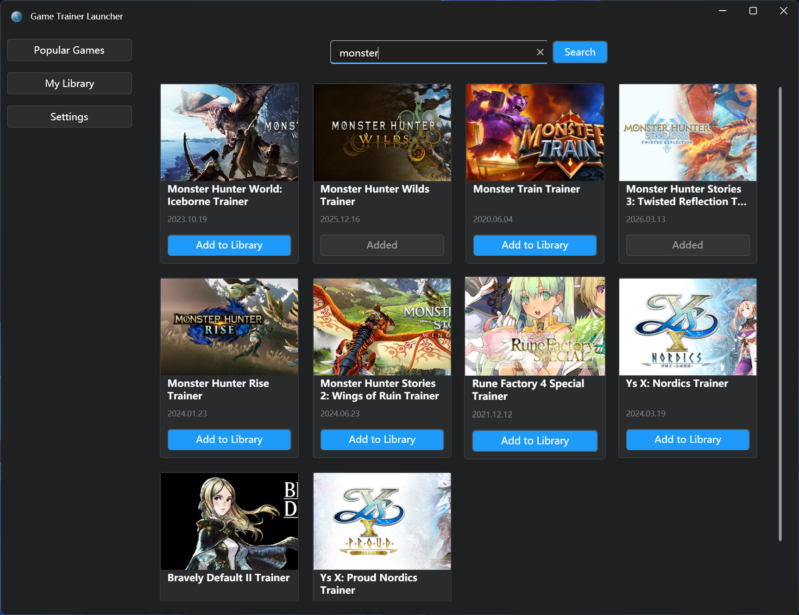
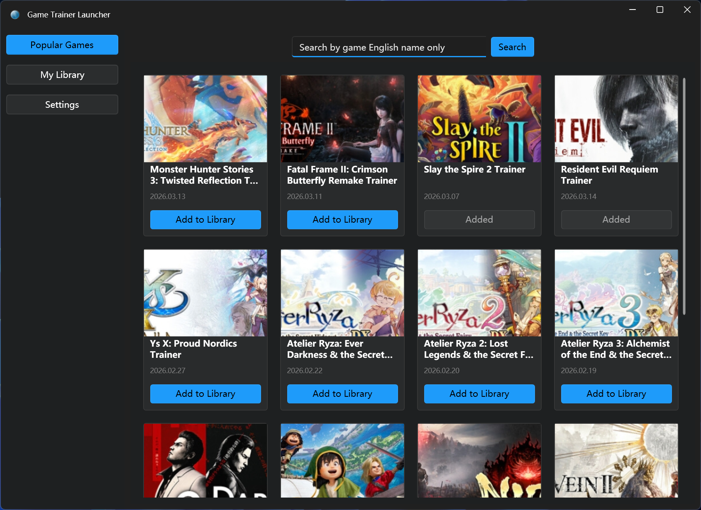
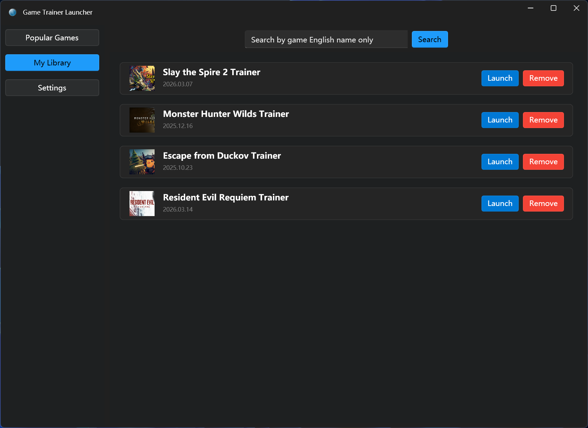
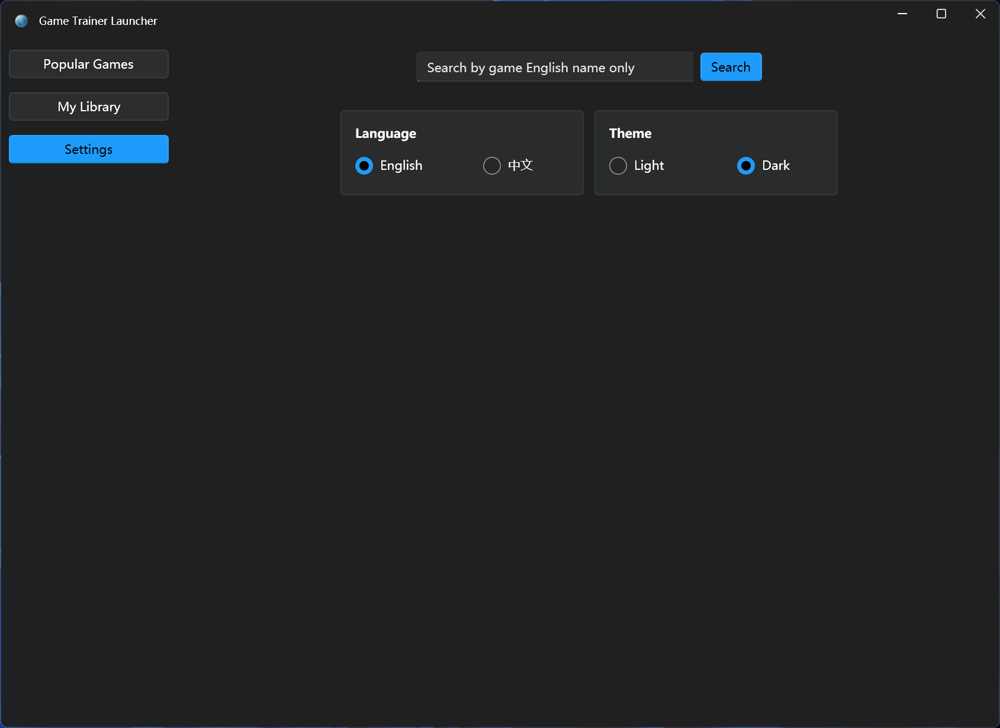

# Game Trainer Launcher

| [中文版](README.md)

Tired of manually downloading and managing lots of game trainer .exe files, and don't want to pay for platforms like flyy.cn or wemod? Try this Windows desktop app based on [FlingTrainer](https://flingtrainer.com): browse, search, download, and launch trainers, and manage your game trainers with ease.

**Download**: [https://github.com/hwttop5/GameTrainerLauncher/releases](https://github.com/hwttop5/GameTrainerLauncher/releases)

---

## Features

- **Search**: Search FlingTrainer by game name (English); add results to library; multiple simultaneous adds with per-card state.
- **Popular Games**: Fetches popular trainers from FlingTrainer; add to library with one click (download + add), progress bar and timeout (1 min).
- **My Library**: List of added trainers; launch or remove; covers are downloaded locally when adding; when entering this page it checks whether each game has a local cover and backfills missing ones automatically; download missing trainers from this page; displays a friendly no-data prompt when the library is empty.
- **Settings**: Language (Chinese/English), theme (light/dark).

---

## Screenshots

| Search | Popular Games |
|--------|---------------|
|  |  |

| My Library | Settings |
|------------|----------|
|  |  |

---

## Tech Stack

- **Runtime**: .NET 8, Windows only (WPF)
- **UI**: WPF + [WPF-UI](https://github.com/lepo-co/wpf-ui) (Fluent-style) + [CommunityToolkit.Mvvm](https://learn.microsoft.com/en-us/dotnet/communitytoolkit/mvvm/)
- **Data**: SQLite + Entity Framework Core 8
- **Scraping**: HtmlAgilityPack for FlingTrainer list/detail/download
- **Logging**: NLog (writes to `Data/Logs/log.txt` under the app directory)

### Project structure

- **GameTrainerLauncher.Core**: Domain entities and interfaces
- **GameTrainerLauncher.Infrastructure**: Scraper, local scanning, database, trainer download and launch
- **GameTrainerLauncher.UI**: WPF UI (MVVM)

---

## Requirements & run

- **Requirements**: .NET 8 SDK, Windows 10/11
- **Restore & build**:
  ```bash
  dotnet restore
  dotnet build
  ```
- **Run**:
  ```bash
  dotnet run --project GameTrainerLauncher.UI
  ```
  Or run `GameTrainerLauncher.UI.exe` from the output directory.

Trainers and data live under `Data` next to the executable (e.g. `Data/Trainers`, `Data/game_trainer_launcher.db`, `Data/Logs`).

> Note: To avoid write-permission issues under Program Files, app data is stored at `%LocalAppData%\GameTrainerLauncher\Data`.
> Local cover cache: `%LocalAppData%\GameTrainerLauncher\Data\Covers` (files like `game_{id}.png/jpg/...`).

---

## Building the exe installer

This repo only supports building a single-file setup (.exe) with [Inno Setup](https://jrsoftware.org/isinfo.php). **Install Inno Setup 6 first.**

**One-step build** (from repo root):
```powershell
.\Installer\build-installer.ps1
```
The setup executable is created at `Installer\Output\GameTrainerLauncher_Setup_1.0.1.exe`.

Alternatively: run `dotnet publish GameTrainerLauncher.UI -p:PublishProfile=FolderProfile`, then open `Installer\GameTrainerLauncher.iss` in Inno Setup and compile.

---

## Notes & disclaimer

- Trainer availability and content depend on FlingTrainer; if the site structure changes, the scraper may need updates.
- This tool is for learning and personal use only; please comply with local laws and game/platform terms.

---

## License

This project is licensed under the **[GNU General Public License v3.0 (GPL-3.0)](LICENSE)**. Use, modification, and distribution must comply with the license.
