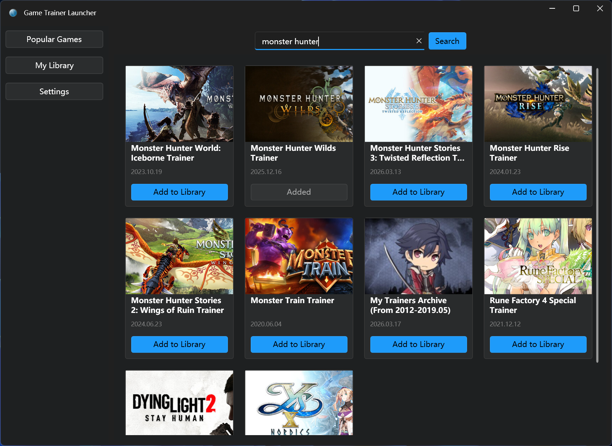

# 游戏修改器启动器 (Game Trainer Launcher)

| [English Version](README.en.md)

受够了手动下载管理众多的游戏修改器.exe文件，又不想在 flyy.cn 和 wemod 这种平台上充会员？试试这款基于 [FlingTrainer](https://flingtrainer.com) 的 Windows 桌面应用：浏览、搜索、下载并启动游戏修改器，轻松管理你的游戏启动器。

---

## 功能概览

- **搜索**：按游戏英文名检索 FlingTrainer，结果可「下载并添加」到我的游戏；支持多任务同时添加、每张卡片独立状态。
- **热门游戏**：拉取 FlingTrainer 热门修改器列表，一键「下载并添加」到我的游戏，带进度条与超时提示。
- **我的游戏**：已添加的修改器列表，支持启动、移除；进入页面时自动检查并补全封面；可在此页对未下载项单独下载。
- **设置**：语言（中文/英文）、主题（亮色/暗色）。

---

## 界面截图

| 搜索 | 热门游戏 |
|------|----------|
|  |  |

| 我的游戏 | 设置 |
|----------|------|
|  |  |

---

## 技术栈

- **运行时**：.NET 8，仅支持 Windows（WPF）
- **UI**：WPF + [WPF-UI](https://github.com/lepo-co/wpf-ui)（Fluent 风格）+ [CommunityToolkit.Mvvm](https://learn.microsoft.com/en-us/dotnet/communitytoolkit/mvvm/)
- **数据**：SQLite + Entity Framework Core 8
- **爬虫**：HtmlAgilityPack，请求 FlingTrainer 列表/详情/下载
- **日志**：NLog（写入程序目录 `Data/Logs/log.txt`）

### 项目结构

- **GameTrainerLauncher.Core**：领域实体与接口
- **GameTrainerLauncher.Infrastructure**：爬虫、本地扫描、数据库、修改器下载与启动
- **GameTrainerLauncher.UI**：WPF 界面（MVVM）

---

## 环境与运行

- **要求**：.NET 8 SDK、Windows 10/11
- **还原与构建**：
  ```bash
  dotnet restore
  dotnet build
  ```
- **运行**：
  ```bash
  dotnet run --project GameTrainerLauncher.UI
  ```
  或直接运行输出目录中的 `GameTrainerLauncher.UI.exe`。

修改器与数据目录位于程序所在目录下的 `Data`（如 `Data/Trainers`、`Data/game_trainer_launcher.db`、`Data/Logs`）。

---

## 开源协议

本项目采用 **[GNU General Public License v3.0 (GPL-3.0)](LICENSE)** 开源协议。使用、修改与分发须遵守该协议。

---

## 说明与免责

- 修改器内容与可用性依赖 FlingTrainer 站点；若站点结构调整，爬虫可能需要更新。
- 本工具仅供学习与个人使用，请遵守当地法律与游戏/平台条款。
